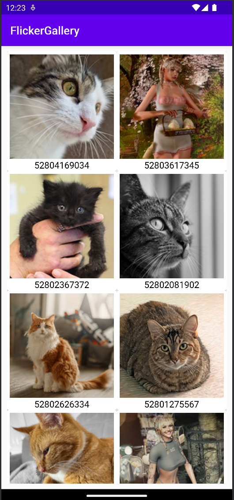

# Infinite Flicks
### A simple gallery for Flickr in Android

Introducing **InfiniteFlicks**, a sleek and modern Android app that brings the captivating world of Flickr photography right to your fingertips! Leveraging the powerful Flickr API, this app offers a visually stunning gallery with infinite scrolling, ensuring you never run out of breathtaking images to explore.

## Screenshots 📱

  
  
</p

## Features 🌟

- **Endless Gallery**: Experience an endless stream of high-quality photos.
- **Full-Screen Images**: Click on an image to display it in full-screen glory.
- **Infinite Scrolling**: Immerse yourself in the beauty and detail captured by talented photographers worldwide.

## Built with ❤️

InfiniteFlicks was built with precision and passion as part of a coding challenge, adhering to standard Android principles and best practices:

- **MVVM Architecture**: Utilizes the Model-View-ViewModel architectural pattern.
- **Kotlin**: Coded in Kotlin, ensuring a clean, efficient, and enjoyable user experience.
- **Android Jetpack**: Leverages the latest Android Jetpack libraries, including LiveData, ViewModel, and Navigation.
- **Retrofit**: Uses Retrofit to fetch data from the Flickr API.
- **Glide**: Uses Glide to load images from the Flickr API.
- **Material Design**: Adheres to Material Design principles, ensuring a clean and intuitive user experience.
- **Unit Tests**: Includes unit tests for the ViewModel and Repository.